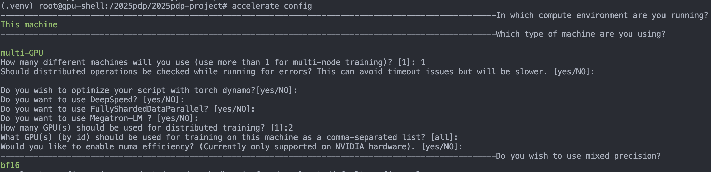

# LLM Inference Optimization Project: INT4 vs INT8 Parallel Processing

This project compares the performance of INT4 quantization on a single GPU versus INT8 quantization using 2-GPU tensor parallelism for Llama models.

## Project Structure

```
/
├── models/                     # Hugging Face model weights repository
├── src/                        # Source code modules
│   ├── model_loader.py         # Model loading logic
│   └── evaluate.py             # Performance/accuracy measurement logic
├── run_benchmark.py            # Main benchmarking execution script
├── analyze_profile_results.py  # Profile results analysis and visualization
├── profile_torch.py            # PyTorch Profiler execution script
├── profile_nsys.sh             # Nsight Systems execution wrapper
├── requirements.txt            # Python library list
└── README.md                   # Project documentation
```

## Installation

1.  Set up your Python environment and install the required libraries.
    (CUDA toolkit and nvcc should be pre-installed for your server)
    ```bash
    python3 -m venv .venv
    source .venv/bin/activate
    pip install -r requirements.txt
    ```
<!-- 
2.  Configure Accelerate for multi-GPU setup
    
    Initialize Accelerate configuration for optimal multi-GPU performance:
    ```bash
    accelerate config
    ```
    
    **Recommended settings:**
    - **Compute environment**: This machine
    - **Machine type**: multi-GPU  
    - **Number of machines**: 1
    - **Number of GPUs**: 2
    - **Mixed precision**: bf16 (for A100 tensor cores optimization)
    - **Other options**: Default values
    
     -->

2.  Download the Llama model from Hugging Face to the `models` directory.
    ```bash
    # Example: Download Llama-3-8B
    export HF_HOME="./models"
    export HF_CACHE_HOME="./models"
    export TRANSFORMERS_CACHE="./models"
    export HF_HUB_CACHE="./models"
    mkdir models
    huggingface-cli login
    huggingface-cli download meta-llama/Meta-Llama-3-8B --local-dir models/Llama-3-8b --local-dir-use-symlinks False
    huggingface-cli download meta-llama/Llama-2-13b-chat-hf --local-dir models/Llama-2-13b-chat --local-dir-use-symlinks False
    ```

## Usage

### 1. Running Benchmarks

Use the `run_benchmark.py` script to measure the performance of each strategy.

**Strategy A: INT4 + 1 GPU**
```bash
python run_benchmark.py --model_path ./models/Llama-3-8b --strategy int4_1gpu
```

**Strategy B: INT8 + 2 GPU (Piepline Parallel)**
```bash
python run_benchmark.py --model_path ./models/Llama-3-8b --strategy int8_2gpu
```

**Strategy B with TP: INT8 + 2 GPU (Tensor Parallel)**

- For now, this function is not implemented.
- INT8 quantization with DeepSpeed Tensor Parallelism is not supported by CUDA accelerator.
- Possible solutions would be : 1) Use Triton kernels, 2) Implement custom INT8 TP solution

**Baseline: BF16 + 2 GPU (Pipeline Parallel)**
```bash
python run_benchmark.py --model_path ./models/Llama-3-8b --strategy baseline
```

### 2. Advanced Profiling

**PyTorch Profiler (Operator Level)**
`profile_torch.py` analyzes CUDA kernel execution times for the INT8 2-GPU strategy.
```bash
python profile_torch.py --model_path ./models/Llama-3-8b
```

**NVIDIA Nsight Systems (System/Communication Level)**
The `profile_nsys.sh` shell script uses `nsys` to trace the entire system and NCCL communication.
```bash
apt update && apt search nsight
apt install -y nsight-systems-2025.1.3

chmod +x ./profile_nsys.sh
./profile_nsys.sh ./models/Llama-3-8b
python analyze_profile_results.py results/20250614_081830 # timestamp of your profiling logs
```
After profiling is complete, you can open the generated `profile_int8_2gpu.nsys-rep` file with the Nsight Systems UI (`nsys-ui`) application to analyze the timeline in detail.